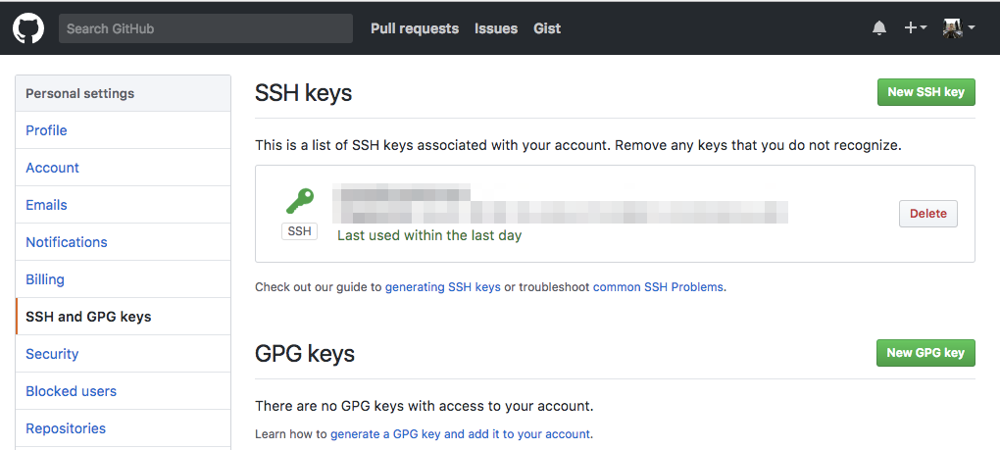

# Cara Pemakaian Git #

## Membuat Repository ##

1. Buat folder untuk project kita

        mkdir training-tazkia

2. Inisialisasi repository lokal di dalam folder tersebut

		cd training-tazkia
		git init

3. Buat file dengan text editor, kemudian save. Misalnya namanya `README.md`

4. Masukkan perubahan ke `staging area`

		git add README.md

5. Simpan perubahan

		git commit -m "menambahkan README"

Catatan :

* Bila baru pertama menggunakan git, pada waktu commit akan muncul pesan error dimana kita disuruh memasukkan nama dan email. Ikuti saja sesuai perintahnya. Setelah memasang nama dan email, kita bisa coba commit lagi

		git config --global user.name "Endy Muhardin"
		git config --global user.email "endy@muhardin.com"

## Mendaftarkan Remote Repository ##

1. Mendaftar dulu di penyedia layanan remote repository seperti:

	* [Github](https://github.com)
	* [Bitbucket](https://bitbucket.org)
	* [Gitlab](https://gitlab.com)

2. Buat repository baru

3. Copy URLnya

4. Daftarkan URL di repository lokal

		git remote add <nama remote> <url remote>
		git remote add github git@github.com:endymuhardin/training-tazkia-2017-01.git

5. Upload isi repo lokal ke remote

		git push <nama remote> <branch yang akan dipush>
		git push github master

6. Supaya tidak perlu menyebutkan `github` dan `master` setiap kali push, gunakan opsi `-u`

		git push -u github master

	Push selanjutnya bisa langsung saja

		git push

## Membuat SSH Keypair ##

1. Jalankan perintah `ssh-keygen` di dalam console Git Bash. Ikuti saja defaultnya.

2. Buka folder `C:\Users\Nama User\.ssh`, kemudian buka file id_rsa.pub dengan text editor. Select All, kemudian copy.

3. Masuk ke [halaman setting SSH Key Github](https://github.com/settings/keys)

	
	

4. Klik New SSH Key. Kemudian paste isi file public key yang di text editor tadi.

	

5. Klik Add SSH Key
