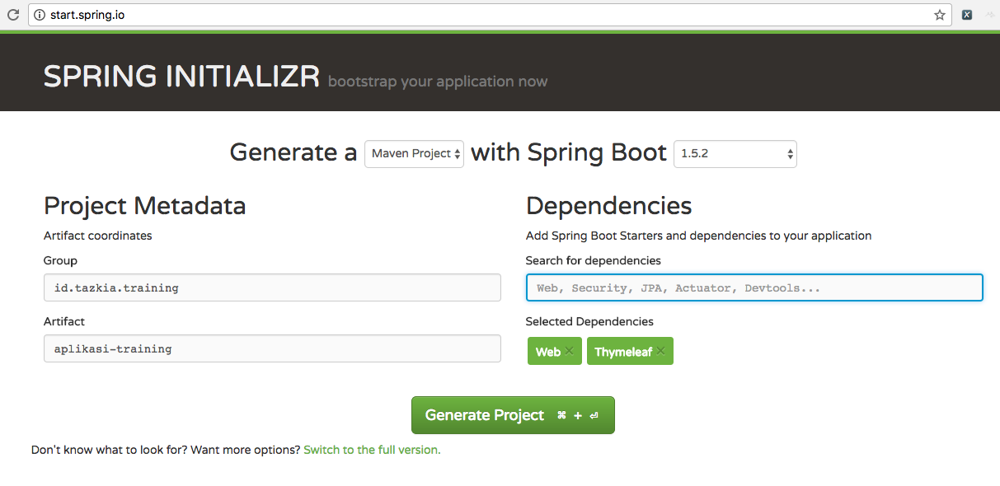

# Membuat Aplikasi dengan Spring Boot #

* Starter App
* Memasang Bootstrap CSS
* Skema Database
* Menampilkan Data dari Database
* Menyimpan Data ke Database
* Upload File
* Login / Logout

## Starter App ##

1. Buka [http://start.spring.io](http://start.spring.io)

2. Isikan Group dan Artifact

	* Group : id.tazkia.training
	* Artifact : aplikasi-training

3. Tambahkan library `Web` dan `Thymeleaf`

	

4. Generate Project

5. Extract hasilnya

6. Buka dengan editor, misalnya Netbeans, Idea, dsb

7. Buka file AplikasiTrainingApplication, klik kanan, kemudian Run

8. Browse ke `http://localhost:8080`


## Memasang Bootstrap CSS ##

1. Buka website Bootstrap dan lihat contoh halamannya : [http://getbootstrap.com/getting-started/#examples](http://getbootstrap.com/getting-started/#examples)

2. Pilih yang sesuai dengan aplikasi yang mau dibuat, misalnya Dashboard

3. View Source, copy, kemudian paste di file `src/main/resources/templates/layout.html`

4. Ganti link menjadi ke internet :

	* `bootstrap.min.css`
	* `bootstrap-theme.min.css`
	* `jquery.min.js`
	* `bootstrap.min.js`

5. Buat file `src/main/resources/static/css/aplikasi.css`. Isinya copy paste dari hasil view source

6. Perbaiki tag-tag yang tidak ada tutupnya, misalnya:

	* `<meta>` menjadi `<meta />`
	* `<link>` menjadi `<link />`
	* `<input>` menjadi `<input />`

7. Ganti bagian content dengan placeholder dari Thymeleaf:

		```html
		<div layout:fragment="content">Di sini content utama</div>
		```

8. Test
